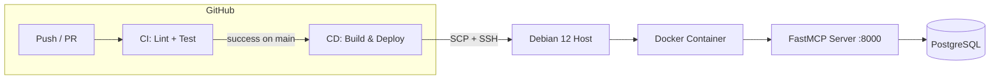

# 📰 News MCP Server

A **FastMCP** (Model Context Protocol) server that connects to PostgreSQL and exposes newsworthy events as AI-queryable tools and resources. Includes a full **GitHub Actions CI/CD** pipeline that lints, tests, and deploys to a **Debian 12** host via Docker.
---

## Architecture



## Project Structure

```
cicd_test/
├── .github/workflows/
│   ├── ci.yml            # Lint (ruff, mypy) + Unit tests
│   └── deploy.yml        # Build Docker image & deploy via SSH
├── src/
│   ├── __init__.py
│   ├── config.py          # Pydantic settings (DATABASE_URL)
│   ├── db.py              # asyncpg helpers (fetch_news, fetch_news_by_id)
│   └── server.py          # FastMCP server with tools & resources
├── tests/
│   ├── __init__.py
│   └── test_server.py     # Unit tests (mocked DB)
├── sql/
│   └── 001_create_news.sql # Table creation & seed data
├── Dockerfile              # Multi-stage, Debian 12 (bookworm)
├── pyproject.toml
├── .env.example
└── .gitignore
```

## MCP Tools & Resources

| Type     | Name             | Description                          |
|----------|------------------|--------------------------------------|
| Tool     | `get_news`       | List recent news items (limit 1–100) |
| Tool     | `get_news_item`  | Look up a single news item by ID     |
| Resource | `news://latest`  | 5 most recent news items             |

---

## Local Development

### Prerequisites

- Python ≥ 3.11
- PostgreSQL instance with a `news` table (see `sql/001_create_news.sql`)

### Setup

```bash
# 1. Clone the repo
git clone <your-repo-url> && cd cicd_test

# 2. Create a virtual environment
python -m venv .venv && source .venv/bin/activate  # Linux/Mac
# .venv\Scripts\activate                            # Windows

# 3. Install with dev dependencies
pip install -e ".[dev]"

# 4. Copy and edit the environment template
cp .env.example .env
# Edit .env with your PostgreSQL connection string

# 5. Create the table
psql "$DATABASE_URL" -f sql/001_create_news.sql
```

### Run the server

```bash
# stdio transport (for Claude Desktop / local agents)
python -m src.server

# streamable-http transport (network, port 8000)
fastmcp run src/server.py
```

### Run the checks

```bash
ruff check src/ tests/           # lint
ruff format --check src/ tests/  # format
mypy src/                        # type check
pytest tests/ -v --tb=short      # unit tests
```

---

## Database Schema

```sql
CREATE TABLE news (
    id            SERIAL PRIMARY KEY,
    title         VARCHAR(300)  NOT NULL,
    body          TEXT          NOT NULL,
    published_at  TIMESTAMPTZ   NOT NULL DEFAULT NOW()
);
```

Run `sql/001_create_news.sql` on your PostgreSQL instance to create the table and insert sample data.

---

## CI/CD Pipeline

### CI (`.github/workflows/ci.yml`)

Triggers on **push** and **pull request** to `main`:

1. **Lint** — `ruff check`, `ruff format --check`, `mypy`
2. **Test** — `pytest` (runs only after lint passes)

### CD (`.github/workflows/deploy.yml`)

Triggers **after CI succeeds** on a push to `main`:

1. Builds the Docker image
2. SCPs the image tarball to the Debian 12 host
3. SSHs in, loads the image, and restarts the container

### Required GitHub Secrets

| Secret            | Description                                              |
|-------------------|----------------------------------------------------------|
| `DEPLOY_HOST`     | IP or hostname of the Debian 12 server                   |
| `DEPLOY_USER`     | SSH username on the server                               |
| `DEPLOY_SSH_KEY`  | Private SSH key (the public key must be in `authorized_keys`) |
| `DATABASE_URL`    | Full PostgreSQL connection string                        |

---

## License

MIT
